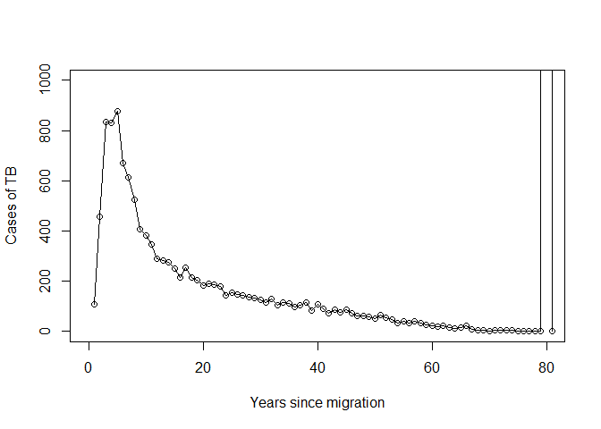
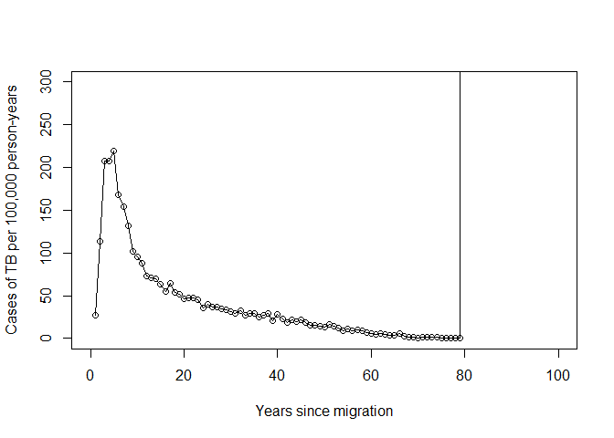

```r
#1. Vandenbroucke, J. P. & Pearce, N. Incidence rates in dynamic populations. Int. J. Epidemiol. 41, 1472–1479 (2012).


library(LTBIscreeningproject)
```

```
## Warning: replacing previous import 'crayon::reset' by 'git2r::reset' when
## loading 'LTBIscreeningproject'
```

```r
library(dplyr)
```

```
## 
## Attaching package: 'dplyr'
```

```
## The following objects are masked from 'package:stats':
## 
##     filter, lag
```

```
## The following objects are masked from 'package:base':
## 
##     intersect, setdiff, setequal, union
```

```r
library(reshape2)
library(tibble)

load(here::here("data", "model_input_cohort.RData"))

attach(IMPUTED_sample)

event_times <-
  list(
    tb = all_tb_issdt,
    # tb = notif_issdt.years,
    exit_uk = date_exit_uk1_issdt.years,
    death = date_death1_issdt.years)

detach(IMPUTED_sample)

lapply(event_times, head, 20)
```

```
## $tb
##  [1] Inf Inf Inf Inf Inf Inf Inf Inf Inf Inf Inf   7 Inf Inf Inf Inf Inf
## [18] Inf Inf Inf
## 
## $exit_uk
##  [1] 1.6075569       Inf       Inf 0.5805046       Inf 1.2794747       Inf
##  [8]       Inf       Inf 1.0064650 1.2184452       Inf       Inf       Inf
## [15] 0.4101696       Inf       Inf 7.9054158       Inf 8.3716472
## 
## $death
##  [1] 84.02946 70.83572 69.71176  1.33474 61.21660 53.16513 65.86426
##  [8] 81.14311 65.90251 43.69316 74.55214 43.56472 59.01388 62.63655
## [15] 77.21618 83.34842 47.86535 69.38264 67.97599 87.31882
```

```r
strat_pop_year <-
  event_times %>%
  count_comprsk_events() #%>%
  #as.tibble()

head(strat_pop_year)
```

```
##   value  tb exit_uk death total_tb total_exit_uk total_death atrisk_end
## 1     1 112   90562   169      112         90562         169     312302
## 2     2 320   92252   123      432        182814         292     219607
## 3     3 353   40823   109      785        223637         401     178322
## 4     4 366   35049    86     1151        258686         487     142821
## 5     5 291    6893   106     1442        265579         593     135531
## 6     6 192    7005    97     1634        272584         690     128237
##   atrisk_start mean_atrisk incid_rate
## 1       403145    357723.5    31.3091
## 2       312302    265954.5   120.3213
## 3       219607    198964.5   177.4186
## 4       178322    160571.5   227.9358
## 5       142821    139176.0   209.0878
## 6       135531    131884.0   145.5825
```

```r
plot(strat_pop_year$tb, type = 'o',
     xlab = "Years since migration", ylab = "Cases of TB")#,
```

<!-- -->

```r
     # xlim = c(0,100), ylim = c(0,400))

plot(strat_pop_year$incid_rate, type = 'o',
     xlab = "Years since migration", ylab = "Cases of TB per 100,000 person-years")#,
```

<!-- -->

```r
     # xlim = c(0,100), ylim = c(0,300))
```


---
title: "dynamic_incidence_table.R"
author: "ngreen1"
date: "Fri Sep 28 09:58:02 2018"
---
