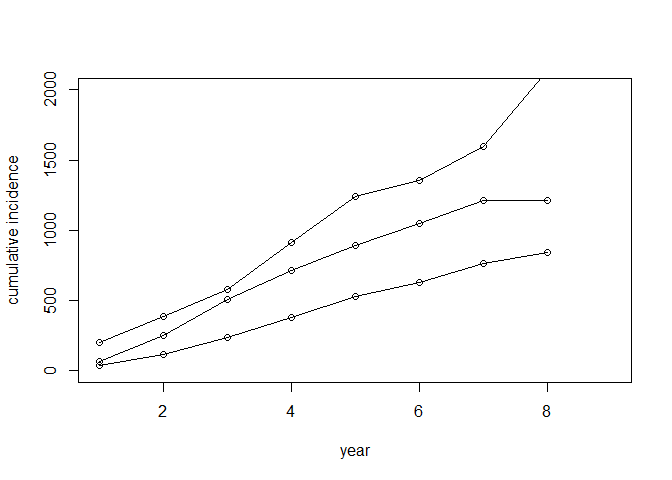

```r
# Campbell et al (2017) PLOS one optimise to fit model parameter values, including the probability of LTBI in their cohort.
# We take this for different WHO incidence categories from Pareek ()
# However, we can check that these values are appropriate for our data by doing the following.


# Using the original cleaned data we can create a table of event counts and year of occurrence.

library(LTBIscreeningproject)
```

```
## Warning: replacing previous import 'crayon::reset' by 'git2r::reset' when
## loading 'LTBIscreeningproject'
```

```r
library(dplyr)
```

```
## 
## Attaching package: 'dplyr'
```

```
## The following objects are masked from 'package:stats':
## 
##     filter, lag
```

```
## The following objects are masked from 'package:base':
## 
##     intersect, setdiff, setequal, union
```

```r
library(reshape2)

load(file = here::here("data", "sample_cleaned.RData"))

event_times <- list(tb = IMPUTED_sample$notif_issdt.years,
                    fup = IMPUTED_sample$fup_issdt,
                    exit_uk = IMPUTED_sample$date_exit_uk1_issdt.years,
                    death = IMPUTED_sample$date_death1_issdt.years)

strat_pop_year <- count_comprsk_events(event_times)


# Furthermore, we can repeat this but stratify by country of origin.
# If we assume that the progression probability from LTBI to active TB between groups is the same
# then the difference between the different group is attributable to the difference in LTBI prevalence
# in the groups

# imputed proportions from Pareek () are
prop.table(table(IMPUTED_sample$who_inc_Pareek2011,
                 IMPUTED_sample$pLTBI))
```

```
##              
##                     0.13        0.2       0.27        0.3
##   (0,50]      0.00000000 0.00000000 0.00000000 0.00000000
##   (50,150]    0.01107294 0.00000000 0.00000000 0.00000000
##   (150,250]   0.00000000 0.44298453 0.00000000 0.00000000
##   (250,350]   0.00000000 0.00000000 0.00000000 0.50810254
##   (350,1e+05] 0.00000000 0.00000000 0.03783998 0.00000000
```

```r
# Create the tables

event_times <- list(tb = IMPUTED_sample$notif_issdt.years[IMPUTED_sample$who_inc_Pareek2011 == "(150,250]"],
                    fup = IMPUTED_sample$fup_issdt[IMPUTED_sample$who_inc_Pareek2011 == "(150,250]"],
                    exit_uk = IMPUTED_sample$date_exit_uk1_issdt.years[IMPUTED_sample$who_inc_Pareek2011 == "(150,250]"],
                    death = IMPUTED_sample$date_death1_issdt.years[IMPUTED_sample$who_inc_Pareek2011 == "(150,250]"])

strat_pop_year150 <- count_comprsk_events(event_times)


event_times <- list(tb = IMPUTED_sample$notif_issdt.years[IMPUTED_sample$who_inc_Pareek2011 == "(250,350]"],
                    fup = IMPUTED_sample$fup_issdt[IMPUTED_sample$who_inc_Pareek2011 == "(250,350]"],
                    exit_uk = IMPUTED_sample$date_exit_uk1_issdt.years[IMPUTED_sample$who_inc_Pareek2011 == "(250,350]"],
                    death = IMPUTED_sample$date_death1_issdt.years[IMPUTED_sample$who_inc_Pareek2011 == "(250,350]"])

strat_pop_year250 <- count_comprsk_events(event_times)


event_times <- list(tb = IMPUTED_sample$notif_issdt.years[IMPUTED_sample$who_inc_Pareek2011 == "(350,1e+05]"],
                    fup = IMPUTED_sample$fup_issdt[IMPUTED_sample$who_inc_Pareek2011 == "(350,1e+05]"],
                    exit_uk = IMPUTED_sample$date_exit_uk1_issdt.years[IMPUTED_sample$who_inc_Pareek2011 == "(350,1e+05]"],
                    death = IMPUTED_sample$date_death1_issdt.years[IMPUTED_sample$who_inc_Pareek2011 == "(350,1e+05]"])

strat_pop_year350 <- count_comprsk_events(event_times)


# We would expect the cumulative incidence plots to have a constant proportional difference over time

plot(cumsum(strat_pop_year150$incid_rate), type = "o", ylim = c(0,2000),
     xlab = "year", ylab = "cumulative incidence")
lines(cumsum(strat_pop_year250$incid_rate), type = "o")
lines(cumsum(strat_pop_year350$incid_rate), type = "o")
```

<!-- -->

```r
# Recall that the Pareek () values are

unique(IMPUTED_sample$pLTBI)
```

```
## [1] 0.20 0.30 0.27 0.13
```

```r
# So we would expect the 3rd group to be 50% larger than the 2nd group
# i.e. from 20% to 30%

# One way to check this is to fit a linear regression to the two curves and compare the gradients

lm150 <- lm(y ~ x - 1,
   data.frame(x = 1:nrow(strat_pop_year150),
              y = cumsum(strat_pop_year150$incid_rate)))


lm250 <- lm(y ~ x - 1,
   data.frame(x = 1:nrow(strat_pop_year250),
              y = cumsum(strat_pop_year250$incid_rate)))

# We find that the estimate probability of LTBI is close to 20%
round(lm150$coefficients/lm250$coefficients * 0.3, 2)
```

```
##    x 
## 0.19
```

```r
# Similarly, we can take the total incidence instead.
# We see that this is also consistent with the Pareek () estimates used in our model.

round((cumsum(strat_pop_year150$incid_rate)/cumsum(strat_pop_year250$incid_rate))[8] * 0.3, 2)
```

```
## [1] 0.21
```


---
title: "strat_pop_year_original_data.R"
author: "ngreen1"
date: "Wed Oct 31 13:26:05 2018"
---
