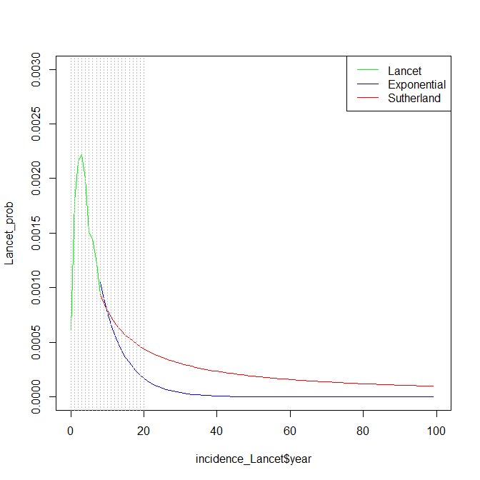

```{r setup, include = FALSE}
knitr::opts_chunk$set(
  collapse = TRUE,
  comment = "#>"
)
```


This vignette steps through how we estimate the unobserved active TB progression.

## Previous studies

There are few references for active TB progression data.
We use the observed incidence in the Lancet (xxxx) paper (taken directly from the plots and the tail probabilities from Sutherland (xxxx).

The counts in the Lancet paper are

```{r fig.width=7, fig.height=5, fig.cap="Cases of tuberculosis notified in migrants to EWNI by time since entry. Aldridge, Lancet (2016)"}
data("incidence_Lancet", package = "LTBIscreeningproject")

plot(incidence_Lancet$mean, type = 's', ylim = c(0,300), xlab = "Year", ylab = "Incidence")
lines(incidence_Lancet$lower95, type = 's', lty = 2)
lines(incidence_Lancet$upper95, type = 's', lty = 2)
```

### Extrapolation

We rescale these counts to proportions.
We also fit an exponential distibution to the tail of the Lancet data.

All of the data can be put together.




## Imputation

We now want to impute individual unobserved progression times to active TB for the cohort.
These are times after exiting UK or after end of follow-up.

We scale the progression probabilities using a weight average of LTBI cohort probabilities, because the progression probabilities generate above are for _all_ individuals whereas we know someone's LTBI status (because we simulate them in the first place). The valued calculated for the cohort is `0.278`.

We calculate separately the times for those that leave EWNI and after end of follow-up.

There are a few ways that we could have done this.
We could have sampled the progression time and if its after the death time then assume no progression. The problem with this is that we have little say on how many people progress. This is fine if the hazards are independent but the progression probabilities that we're using are in the presence of competing risk of all-cause mortality. We could just ignore this of course which may be reasonable in some circumstances like when the death rate is low e.g. at younger ages.

An alternative way of generating progression times is by a two-step mixture model-type approach. That is, we first sample whether someone progresses and then we sample the time of progression. In this way we can control the proportion of progressors.

Construct the time to active TB as a mixture model with 2 components.

$$
p(\text{infected}) \times p(\text{infected at $T=t$ | infected}).
$$
The conditional probability $p(\text{infected at $T=t$ | infected})$ is produced from Sutherland () and extrapolating assuming an exponential decay to 1 in lifetime.
The marginal probability $p(\text{infected})$ is the chance of being infected in a lifetime.

The reason to do it like this is so that we can easily see the value of $p(\text{infected})$ for different estimates found in literature, without modifying $p(\text{infected at $T=t$ | infected})$.

From @Pareek2011, they chose a conservative rate for LTBI to active TB of 5% over 20 years.
@Marks2000a calculated a progression rate of 6.7% over 40 years.
@Choudhury2013 estimated 13% over 10 years or 16.3% over 15 years.
2006 NICE economic appraisal said LTBI testing is cost-effective over 18% chance over 15 years and 2001 NICE economic appraisal reduced this to 12%.


The algorithm is as follows:

* Check that they are LTBI and that the first event is exiting EWNI or end of followup. If not stop.
* Sample $U \sim Unif[0,1]$.
    + If $U>lifetimeRisk$ then no progression. Stop.
    + Otherwise TB progression.
* If followup time is the same as death time return followup time. Stop.
* Sample from ECDF of TB progression times until $t_{tb} < t_{death}$.
* End.


# References


